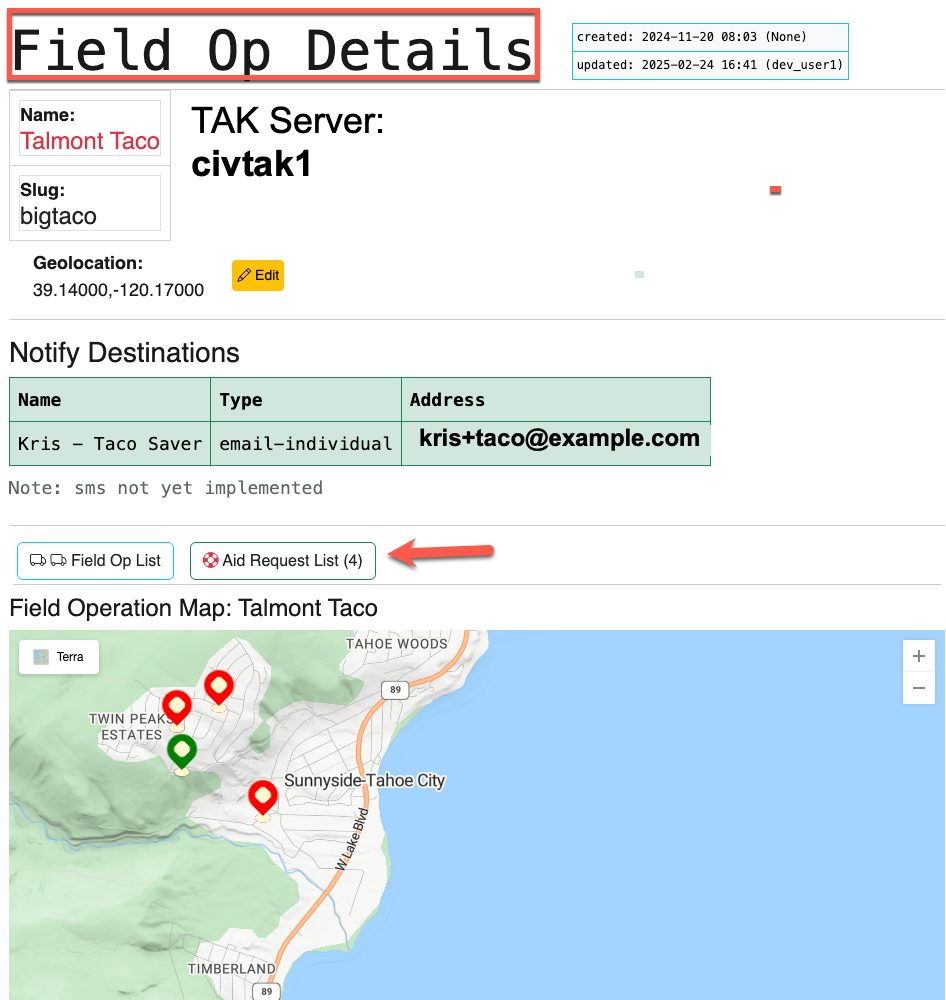
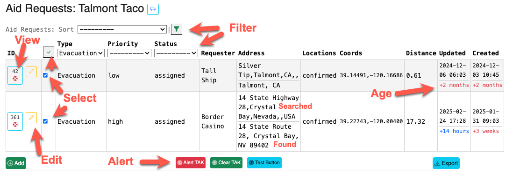
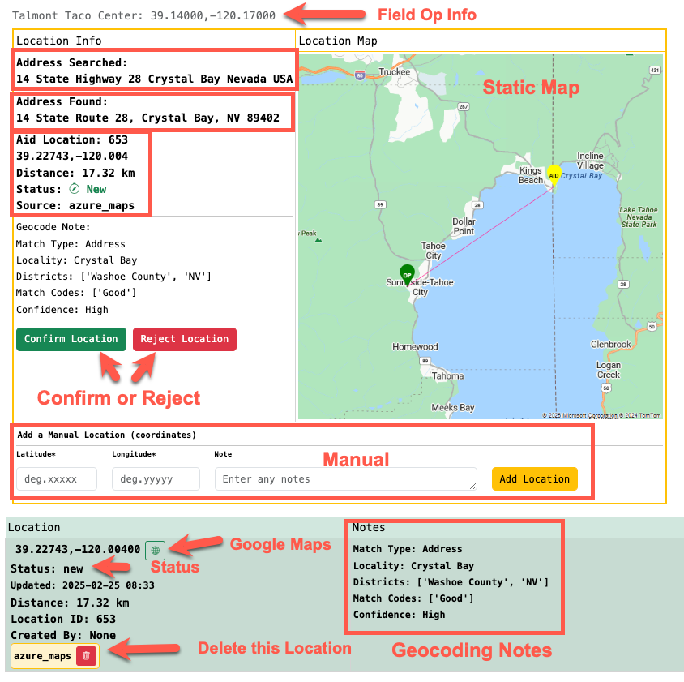

# InForms - Intake Forms Application

InForms is a custom Django (python) web application.

InForms can be used to create Field Operations and solicit Aid Requests.

## Why InForms

Using Google Forms and Survey Monkey can collect the user input (aka, the Aid Request) via Forms and summarize it in tables and spreadsheets. However, the workflow (business logic) for data after the Aid Request was received was undeveloped.

By using a custom web application (written in Django, a framework for Python), the Aid Request `form data` goes directly into a workflow to add maps and notify the Field Operation team.

## Why Django

Python is a nice programming language. Django is a web application framework for Python.

Django implements an MTV - Model, Template, View framework. MVT is a software design pattern for developing a web application.

Here is a note from GeeksforGeeks on Django Project MVT Structure:

* [https://www.geeksforgeeks.org/django-project-mvt-structure](https://www.geeksforgeeks.org/django-project-mvt-structure)

## Field Ops

A Field Operation (aka Field Op, or field_op) is defined with the follow attributes:

* name; Title, use Caps
* slug; short, lowercase
* map coordinates; latitude,longitude - up to 5 decimal points
* aid types; a set of Aid Types for this Field Op
* notifies; a set of Notify destinations (email)
* TAK Server; DNS name of the server to send TAK Alerts (aka COT) messages



## Aid Requests

InForms is used to collect Aid Requests by HTML forms.

To submit a new Aid Request, use the name of the server followed by the `/<slug>` of the Field Op, e.g.:

* ```https://support.example.com/bigtaco```

Note that this page is NOT authenticated (no user required), as it is intended to be available to the public to input Aid Requests.

Aid Requests ask for the following info from the requestor:

* Requester Name
* Phone or Email
* Aid Contact Name, Phone/Email (if different)
* Contact methods (text area to describe preferences)
* Aid Type (select from set defined for this Field Op)
* Group Size
* Aid Description
* Location of Aid Request: street address, city, state, zip, country
* Additional Info: medical, supplies, welfare

### Aid Requests List

Use the Aid Requests List page to view and map Aid Requests.
e.g.

* `https://support.example.com/bigtaco/aidrequest/list/`

From the list page, you can Alert TAK for selected Aid Requests, view or edit an existing Aid Request.



The checkmark at the top of the select column can be used to Select/Unselect All. These these checkmarks to bulk send TAK Alerts (or Clear).

The Aid Requests List page also provides a map with distinct markers for each Aid Type.
Distinct marker icons can be set for each Aid Type in the `/admin` pages.

### Aid Request - Details

Use the Aid Request Details page to manage the Location(s) associated to a given Aid Request.

When a new Aid Request is submitted, the Informs application will request Geocoding (location) for the address from Azure Maps, along with the generation of a static map image. This location information is stored in the database and initially set to New.

The Aid Request Details page should be used to Confirm or Reject existing locations.

A `Manual` location can be added, and `Confirmed`.

The Aid Request will use the first `Confirmed` or first `New` location as the `location` for the Aid Request.



The Aid Request Details page can also be used to add Activity Logs.
