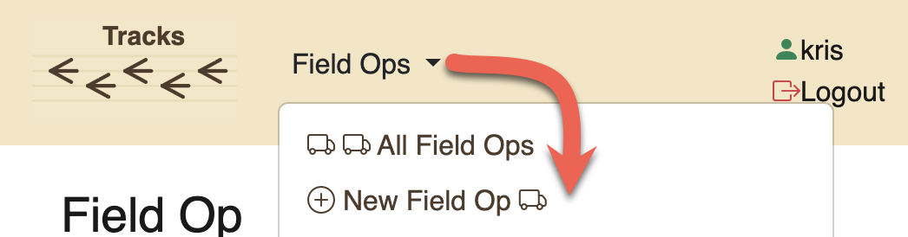
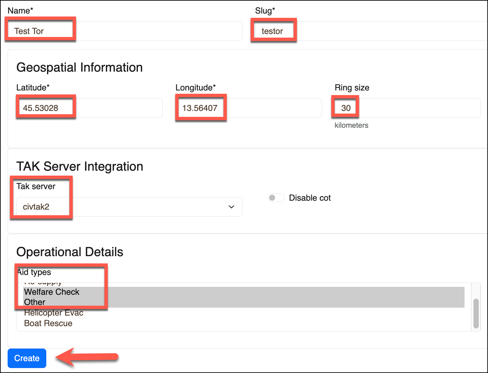
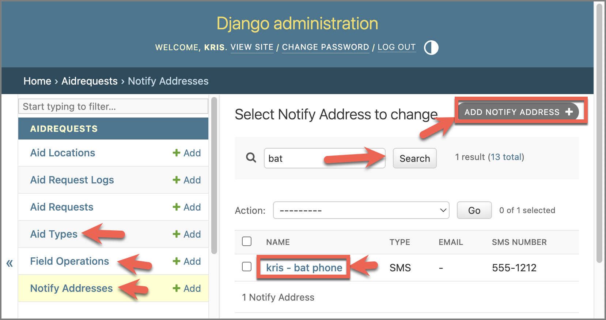
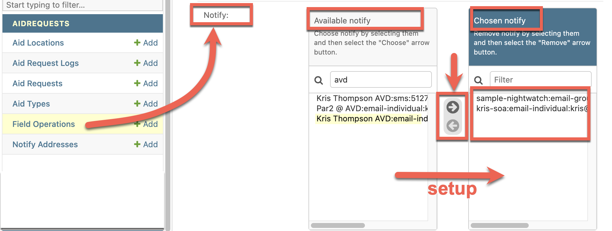
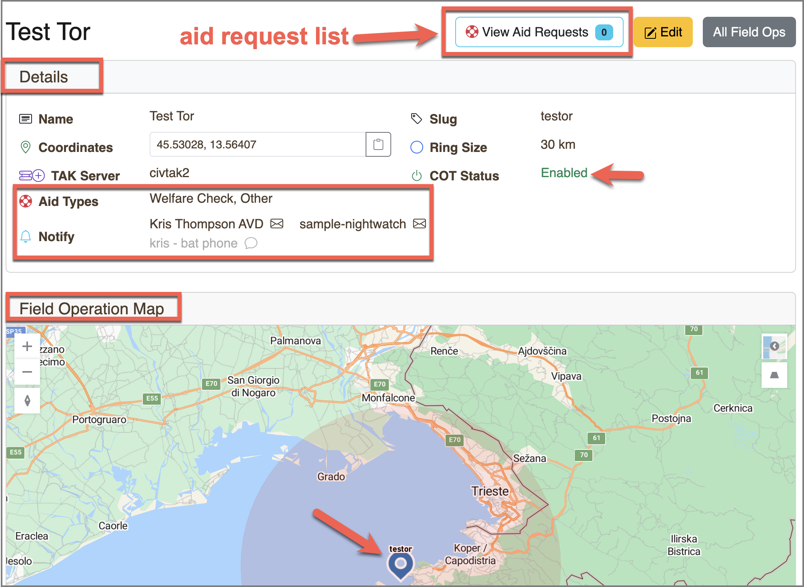
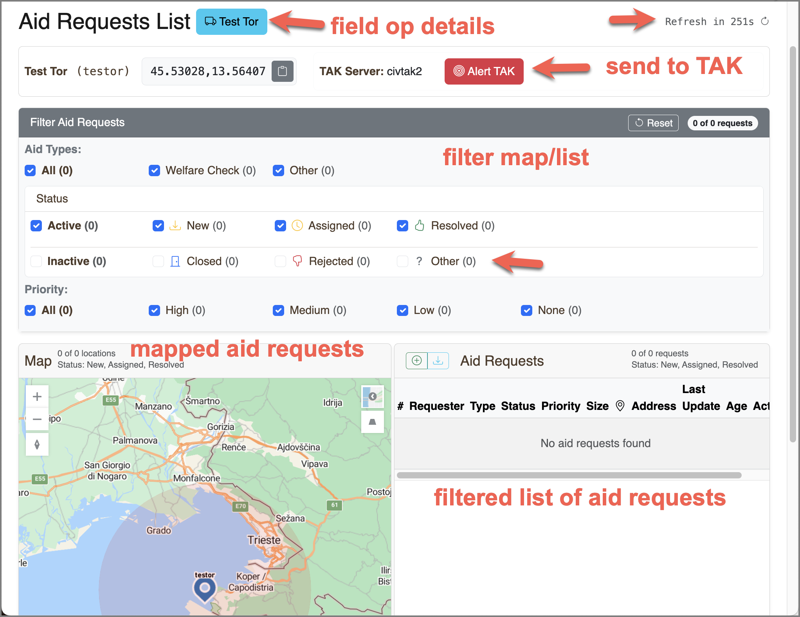

+ [Table of Contents](toc.md)

## Field Operations Overview

Each Field Operations is defined by its attributes:
- name (title)
- slug (short name)
- location (latitude, longitude)
- ring size (for scale marker on map)
- TAK server to use for COT messages (alerts)
- Aid Types: types of aid requests
  -- check, supply, evac
- notify destinations (email) **

** notify destinations only set in the `/admin` pages

#### Field Operation URLs:

    /fieldops
    /fieldop/create

These are available from the top menu.

## Create a Field Op

Provide a proper name, slug, coordinates, and ring size for a new Field Op as shown in the screenshot below.

Tips:
- use a proper name, e.g. "North Carolina - 2024 - Hurricane Helene"
- a distinct slug, e.g. "nc2024" - short is best
- coordinates are used to center the region of the field op, five (5) decimal places is sufficient
- provide the ring size in kilometers

When managing the Field Op, two views of the field op are available:
- Field Op Details page. Use for managing the Field Op settings.
- Aid Requests list page. Use this page for managing the Aid Requests associated to the field op.

Some of the settings for the Field Op are set in the `/admin` pages.

## Notify Destinations

NB: The Notify Destinations for the Field Op are set in the `/admin` pages (notifies). The `/admin` pages are only accessible to staff users.

Use the admin pages to create and manage the 'notify destinations' for the Field Op. These pages can also be used to define and change the Aid Types that can be made available to the Field Ops.

Notes:
- setup new aid types if needed to be used in the Field Op
- create notify addresses if needed to be used in the Field Op
  - SMS or email, although SMS is not yet implemented
- setup and manage notify destinations for the Field Op

Be sure to `save` the changes made to the Field Op.

## Field Op Details

Use the Field Op dropdown in the top navigation bar to access the Field Op Details page. Validate all the setttings.
- Aid Types
- Notify Destinations
- TAK Server and COT status

Notice the link to the Aid Requests list page.

## Field Op Aid Requests List

Use the link to the Aid Requests list page to access the Aid Requests list page.

Notice the link to the Field Op Details page.

## Next
Learn about managing Aid Requests.

+ [Aid Requests](aidrequests.md)

Return to the Table of Contents

+ [Table of Contents](toc.md)