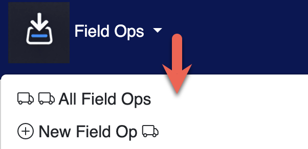
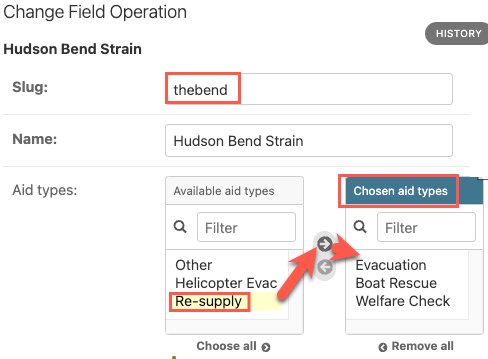
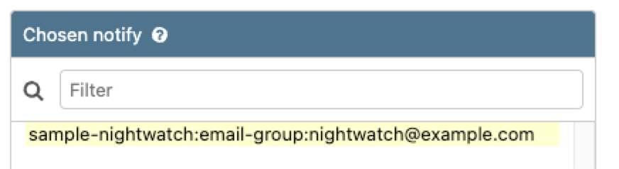
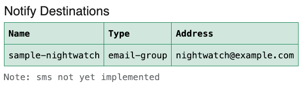

# Field Operations

## Overview

Each Field Operations defines:
- name
- 'slug' (short name)
- location (latitude, longitude)
- ring size (for scale)
- TAK server to use for COT messages (alerts)
- Aid Types: categories of aid requests
- notify destinations (email) **

** notify destinations only set in the `/admin` pages

### Field Operation URLs:

    /fieldop/list
    /fieldop/create

These are available from the top menu.

## Create a Field Op

Note that several of the `FieldOp` settings can only be set in the `/admin` pages (aid_types, notifies).

Move Aid Types from `available` to `chosen` as desired for the Field Op.

Still in `/admin`, set the TAK Server and the notify destinations (email) for the Field Op.

Be sure to `save` the changes made to the Field Op.

The Notify destinations are shown on the Field Op Details page.

