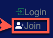
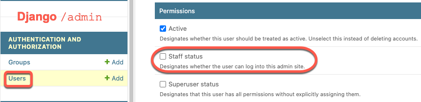
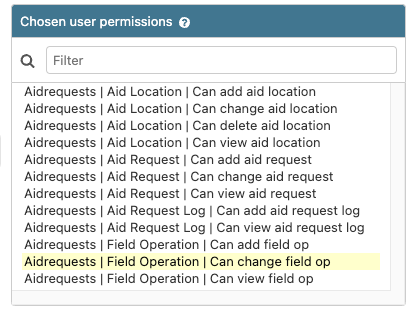
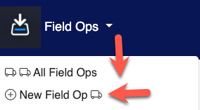
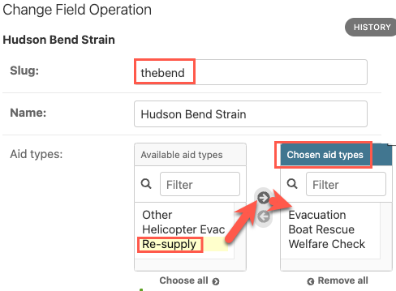
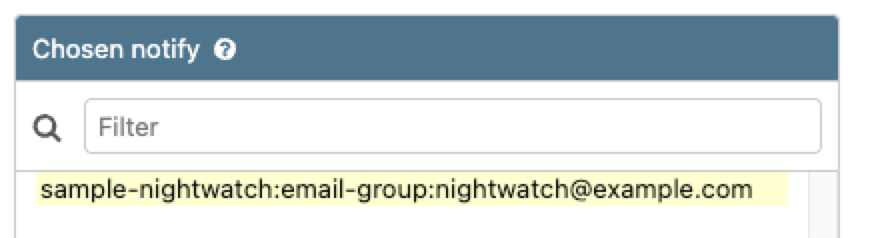
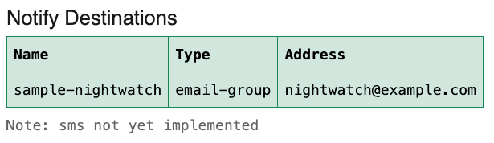

# InForms Application Overview

## Table of Contents

1. [Overview](#informs-overview)
2. [Create a User](#create-an-informs-user)
3. [Create a Field Op](#create-a-field-op)

## Informs Overview

Welcome to the documentation overview. This guide will help you understand the basics and get started quickly.

## Create an Informs User

You can register your own user. Look for the Join button (top-right).

An existing application administrator will need to add required permissions to the new user (via `/admin` pages.)

For example:

Note the distinct checkbox to provide access to the `/admin` pages.

If not using admin (aka `staff`), or `superuser`, you can also set individual permissions to support distinct roles.

## Create a Field Op

Use the top Drop Down menu to add a new Field Op.

Note that several of the `FieldOp` settings can only be set in the `/admin` pages (aid_types, notifies).

Move Aid Types from `available` to `chosen` as desired for the Field Op.

Still in `/admin`, set the TAK Server and the notify destinations (email) for the Field Op.

Be sure to `save` the changes made to the Field Op.

The Notify destinations are shown on the Field Op Details page.

