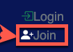
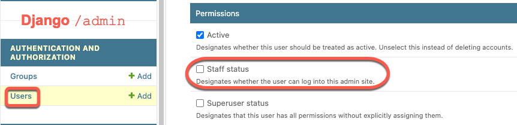
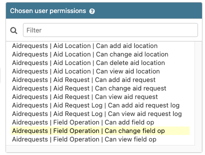

# Getting Started with Informs

## Create an Informs User

You can register your own user. Look for the Join button (top-right).

An existing application administrator will need to add required permissions to the new user (via `/admin` pages.)

For example:

Note the distinct checkbox to provide access to the `/admin` pages.

If not using admin (aka `staff`), or `superuser`, you can also set individual permissions to support distinct roles.

Next, you can create a new Field Op.

+ [Field Operations](fieldop.md)

or return to the [Table of Contents](toc.md)!
