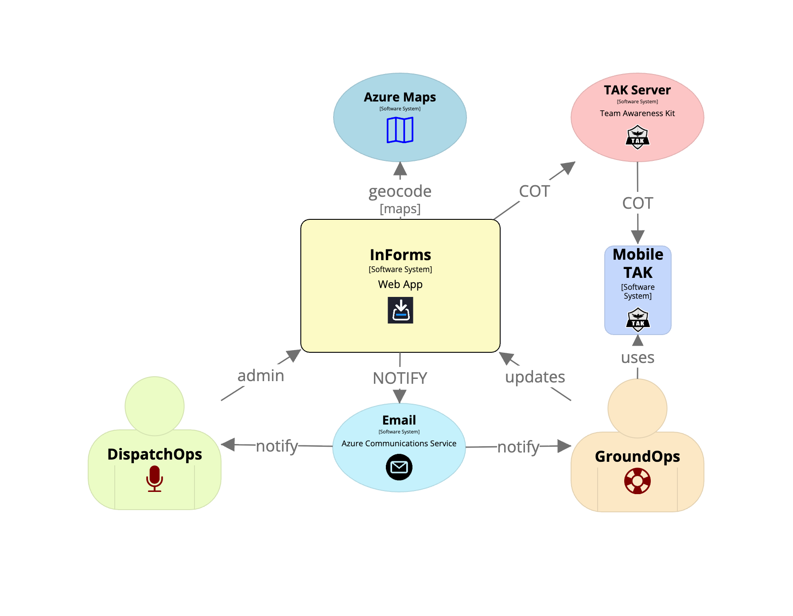
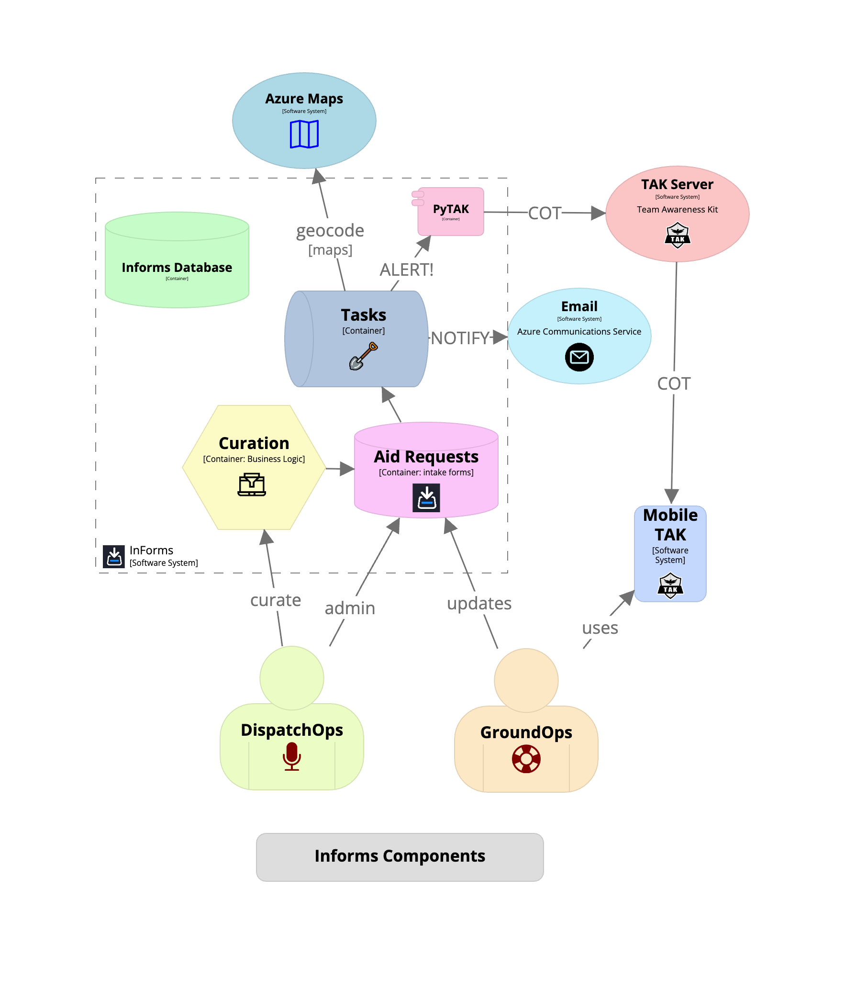

# InForms Application Overview

<!--
TODO: Add more details here about the new feature.
Maybe include a screenshot?
-->
TOC:
1. [Overview](#informs-overview)
2. [Create an Informs User](#create-an-informs-user)
3. [Create a Field Op](#create-a-field-op)

## Informs Overview

Informs is a custom Django (python) web application. It typically runs in a docker container (two actually), on an internet hosted linux server (virtual machine).

Aid Requests are created by submitting a form that is publicly accessible to the public.

This diagrams shows a system overview of the Informs application.

The Informs application uses the following components:
- Field Operations (aka Field Ops)
- Aid Request Forms
- Aid Requests - grouped by Field Op
- Aid Locations - for each Aid Request
- PyTAK library for sending COT (TAK)
- Task processor
  - geocoding/mapping
  - email notifications
  - sending COT (TAK) messages
- Azure Email service
  - notify
- Azure Maps service
  - geocoding
  - mapping
  - static map images

Each Aid Requests is associated to a predefined Field Operation.

+ [Table of Contents](toc.md)!
